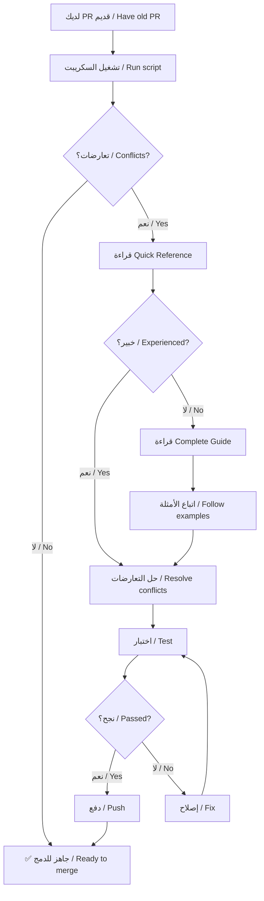
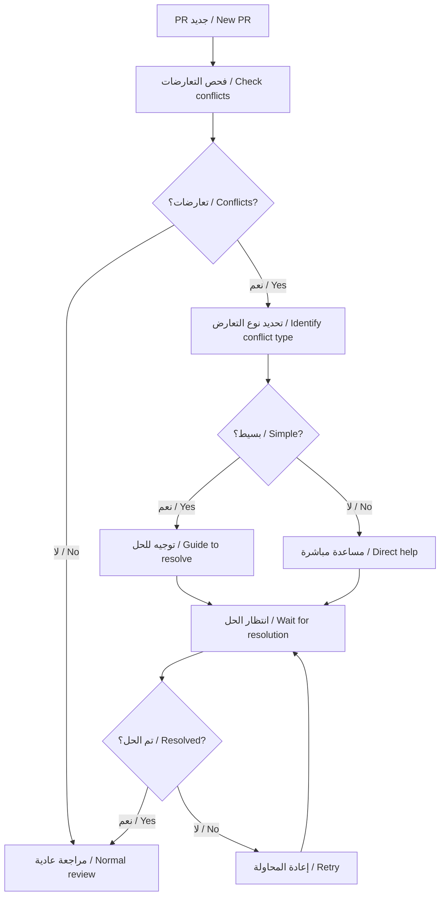

# ملخص حل مشاكل الدمج - Merge Conflicts Resolution Summary

تاريخ: 2026-01-23  
الحالة: ✅ مكتمل / Complete

---

## 📋 الملخص التنفيذي / Executive Summary

تم إنشاء مجموعة شاملة من الأدوات والوثائق لحل مشاكل الدمج (Merge Conflicts) في Pull Requests المفتوحة.

A comprehensive set of tools and documentation has been created to resolve merge conflicts in open Pull Requests.

---

## 🎯 المشكلة / The Problem

**بالعربية:**
عدة Pull Requests مفتوحة تواجه مشاكل في الدمج (unable to merge) بسبب تعارضات مع الفرع الرئيسي (main branch).

**In English:**
Multiple open Pull Requests are facing merge issues (unable to merge) due to conflicts with the main branch.

---

## ✅ الحل / The Solution

تم إنشاء **5 موارد رئيسية** لمساعدة المساهمين والمشرفين:

**5 main resources** have been created to help contributors and maintainers:

### 1. 🚀 البطاقة المرجعية السريعة / Quick Reference Card
**الملف / File:** `QUICK_REFERENCE_MERGE_CONFLICTS.md`

**المحتوى / Content:**
- الأوامر السريعة للاستخدام اليومي
- Quick commands for daily use
- نصائح مختصرة وسريعة
- Short and fast tips
- أنماط الحلول الشائعة
- Common solution patterns

**الاستخدام / Use when:**
- تحتاج حل سريع
- Need a quick solution
- لديك خبرة سابقة
- Have previous experience
- تريد مرجع سريع
- Want quick reference

---

### 2. 📖 الدليل الكامل / Complete Guide
**الملف / File:** `MERGE_CONFLICT_RESOLUTION_GUIDE.md`

**المحتوى / Content:**
- شرح مفصل لكل خطوة
- Detailed explanation of each step
- أمثلة متعددة ومتنوعة
- Multiple diverse examples
- الطريقتين: Web UI و Command Line
- Both methods: Web UI & Command Line
- اعتبارات الأمان
- Security considerations

**الاستخدام / Use when:**
- مبتدئ في Git
- Beginner in Git
- تحتاج شرح تفصيلي
- Need detailed explanation
- تريد فهم كل خطوة
- Want to understand each step

---

### 3. 📊 حالة الفروع / Branch Status
**الملف / File:** `BRANCH_MERGE_STATUS.md`

**المحتوى / Content:**
- معلومات الفرع الرئيسي
- Main branch information
- الملفات الأكثر عرضة للتعارض
- Most conflict-prone files
- استراتيجيات الدمج المختلفة
- Different merge strategies
- أنماط التعارض الشائعة
- Common conflict patterns

**الاستخدام / Use when:**
- تريد فهم المستودع
- Want to understand the repository
- تخطط لتحديث PR قديم
- Planning to update old PR
- تريد تجنب التعارضات
- Want to avoid conflicts

---

### 4. 🔧 الأداة الآلية / Automated Tool
**الملف / File:** `scripts/check-merge-conflicts.sh`

**الوظائف / Functions:**
- ✅ فحص تلقائي للتعارضات
- ✅ Automatic conflict detection
- ✅ تحليل نوع الملفات المتعارضة
- ✅ Analyze conflicted file types
- ✅ توصيات خاصة بكل نوع
- ✅ Type-specific recommendations
- ✅ معلومات تفصيلية عن الفرع
- ✅ Detailed branch information

**الاستخدام / Usage:**
```bash
# Check current branch
./scripts/check-merge-conflicts.sh

# Check specific branch
./scripts/check-merge-conflicts.sh branch-name
```

---

### 5. 💡 مثال عملي / Practical Example
**الملف / File:** `EXAMPLE_CONFLICT_RESOLUTION.md`

**المحتوى / Content:**
- سيناريو كامل من البداية للنهاية
- Complete end-to-end scenario
- حل حقيقي لتعارضات متعددة
- Real solution for multiple conflicts
- أمثلة على 3 أنواع ملفات
- Examples of 3 file types
- النتيجة قبل وبعد
- Result before and after

**الاستخدام / Use when:**
- تريد رؤية مثال كامل
- Want to see complete example
- تتعلم بالأمثلة
- Learn by examples
- تريد نموذج للمحاكاة
- Want a model to follow

---

## 📚 الموارد المتوفرة / Available Resources

### للمساهمين / For Contributors

| المورد / Resource | الغرض / Purpose | الرابط / Link |
|-------------------|-----------------|----------------|
| 🚀 Quick Reference | حل سريع / Quick fix | [QUICK_REFERENCE_MERGE_CONFLICTS.md](./QUICK_REFERENCE_MERGE_CONFLICTS.md) |
| 📖 Complete Guide | دليل شامل / Full guide | [MERGE_CONFLICT_RESOLUTION_GUIDE.md](./MERGE_CONFLICT_RESOLUTION_GUIDE.md) |
| 💡 Example | مثال عملي / Practical example | [EXAMPLE_CONFLICT_RESOLUTION.md](./EXAMPLE_CONFLICT_RESOLUTION.md) |
| 🔧 Script | أداة فحص / Check tool | `./scripts/check-merge-conflicts.sh` |

### للمشرفين / For Maintainers

| المورد / Resource | الغرض / Purpose | الرابط / Link |
|-------------------|-----------------|----------------|
| 📊 Branch Status | حالة المستودع / Repo status | [BRANCH_MERGE_STATUS.md](./BRANCH_MERGE_STATUS.md) |
| 🔧 Script | أداة فحص / Check tool | `./scripts/check-merge-conflicts.sh` |
| 📖 Complete Guide | مرجع كامل / Full reference | [MERGE_CONFLICT_RESOLUTION_GUIDE.md](./MERGE_CONFLICT_RESOLUTION_GUIDE.md) |

---

## 🔄 سير العمل الموصى به / Recommended Workflow

### للمساهمين / For Contributors



### للمشرفين / For Maintainers



---

## 📊 الإحصائيات / Statistics

### الملفات الأكثر عرضة للتعارض / Most Conflict-Prone Files

| الترتيب / Rank | الملف / File | التغييرات / Changes | الأولوية / Priority |
|---------------|--------------|---------------------|---------------------|
| 1 | `.github/workflows/security.yml` | 10 | 🔴 عالية / High |
| 2 | `pages/api/payments/approve.js` | 9 | 🔴 عالية / High |
| 3 | `domains/tec/README.md` | 6 | 🟡 متوسطة / Medium |
| 4 | `.github/workflows/codacy.yml` | 6 | 🔴 عالية / High |
| 5 | `package.json` | 4-5 | 🔴 عالية / High |

### أنواع التعارضات / Conflict Types

| النوع / Type | الشيوع / Frequency | الصعوبة / Difficulty | الحل / Solution |
|--------------|-------------------|---------------------|----------------|
| Dependencies | 🔵🔵🔵🔵 40% | 🟢 سهل / Easy | Merge both |
| Code logic | 🔵🔵🔵 30% | 🟡 متوسط / Medium | Review carefully |
| Config files | 🔵🔵 20% | 🟢 سهل / Easy | Merge both |
| Workflows | 🔵 10% | 🔴 صعب / Hard | Prefer main |

---

## ✅ الميزات / Features

### ما تم توفيره / What's Provided

✅ **وثائق ثنائية اللغة**  
✅ **Bilingual documentation** (Arabic + English)

✅ **أداة فحص آلية**  
✅ **Automated checking tool**

✅ **أمثلة عملية حقيقية**  
✅ **Real practical examples**

✅ **تحليل ذكي للملفات**  
✅ **Smart file analysis**

✅ **توصيات خاصة بكل نوع**  
✅ **Type-specific recommendations**

✅ **اعتبارات أمنية**  
✅ **Security considerations**

✅ **أوامر جاهزة للنسخ**  
✅ **Copy-paste ready commands**

✅ **مرجع سريع للطوارئ**  
✅ **Quick reference for emergencies**

---

## 🎓 الدروس المستفادة / Lessons Learned

### من تحليل المستودع / From Repository Analysis

1. **Most conflicts are in workflows**
   - معظم التعارضات في workflow files
   - Recommendation: Coordinate workflow changes

2. **Package files conflict frequently**
   - ملفات package تتعارض بكثرة
   - Recommendation: Merge dependencies carefully

3. **Payment APIs are actively developed**
   - APIs الدفع يتم تطويرها بنشاط
   - Recommendation: Keep security updates

4. **Documentation updates are common**
   - تحديثات التوثيق شائعة
   - Recommendation: Safe to merge both versions

---

## 🔐 اعتبارات الأمان / Security Considerations

### ملفات حساسة / Sensitive Files

عند حل التعارضات في هذه الملفات، **احتفظ دائماً بنسخة main**:

When resolving conflicts in these files, **always keep main's version**:

1. `.github/workflows/security.yml`
2. `pages/api/auth/**`
3. `pages/api/payments/**`
4. Any authentication/authorization code
5. Any validation/sanitization code

### القاعدة الذهبية / Golden Rule

**"Security updates from main > Your features"**

**"تحديثات الأمان من main > ميزاتك"**

---

## 📞 الدعم والمساعدة / Support and Help

### للحصول على المساعدة / To Get Help

1. **قراءة الوثائق / Read documentation**
   - Start with Quick Reference
   - Read Complete Guide if needed
   - Check Example for real scenario

2. **استخدام الأدوات / Use the tools**
   ```bash
   ./scripts/check-merge-conflicts.sh
   ```

3. **السؤال في PR / Ask in PR**
   - Comment on your PR
   - Explain the conflict
   - Tag a maintainer if needed

4. **الاتصال بالمشرفين / Contact maintainers**
   - For complex conflicts
   - For security-related files
   - For guidance

---

## 🚀 التحسينات المستقبلية / Future Improvements

### المخطط / Planned

- [ ] إضافة فيديو تعليمي
- [ ] Add video tutorial

- [ ] دمج مع CI/CD للكشف التلقائي
- [ ] Integrate with CI/CD for auto-detection

- [ ] إنشاء قوالب PR مع نصائح الدمج
- [ ] Create PR templates with merge tips

- [ ] إضافة المزيد من الأمثلة
- [ ] Add more examples

- [ ] أداة تفاعلية على الويب
- [ ] Interactive web tool

---

## 📝 التغييرات / Changes Made

### الملفات المُنشأة / Files Created

1. ✅ `MERGE_CONFLICT_RESOLUTION_GUIDE.md` (10,425 bytes)
2. ✅ `QUICK_REFERENCE_MERGE_CONFLICTS.md` (5,604 bytes)
3. ✅ `BRANCH_MERGE_STATUS.md` (8,953 bytes)
4. ✅ `EXAMPLE_CONFLICT_RESOLUTION.md` (10,015 bytes)
5. ✅ `scripts/check-merge-conflicts.sh` (6,246 bytes)
6. ✅ هذا الملف / This file

### الملفات المُحدّثة / Files Updated

1. ✅ `README.md` - Added merge conflict section
2. ✅ `README_AR.md` - Added merge conflict section (Arabic)

### الحجم الإجمالي / Total Size

**~42 KB** من الوثائق والأدوات  
**~42 KB** of documentation and tools

---

## 🎯 الخلاصة / Conclusion

### ما تم إنجازه / What Was Accomplished

✅ **مشكلة واضحة / Clear problem definition**  
حددنا المشكلة: تعارضات الدمج في PRs المفتوحة

✅ **حل شامل / Comprehensive solution**  
أنشأنا 5 موارد مترابطة للحل

✅ **أدوات آلية / Automated tools**  
سكريبت فحص ذكي مع تحليل تفصيلي

✅ **وثائق ثنائية اللغة / Bilingual docs**  
دعم كامل للعربية والإنجليزية

✅ **أمثلة عملية / Practical examples**  
سيناريوهات حقيقية مع حلول كاملة

### التأثير المتوقع / Expected Impact

📈 **تقليل وقت حل التعارضات**  
📈 **Reduce conflict resolution time**  
من 30-60 دقيقة إلى 10-20 دقيقة  
From 30-60 minutes to 10-20 minutes

📈 **تقليل الأخطاء**  
📈 **Reduce errors**  
أقل احتمال لحذف تحديثات مهمة  
Less chance of deleting important updates

📈 **تحسين تجربة المساهمين**  
📈 **Improve contributor experience**  
أسهل للمبتدئين في Git  
Easier for Git beginners

📈 **حماية الأمان**  
📈 **Protect security**  
تذكير دائم بالحفاظ على تحديثات الأمان  
Constant reminder to keep security updates

---

## 🎉 الوضع الحالي / Current Status

### ✅ جاهز للاستخدام / Ready to Use

- ✅ جميع الوثائق مكتملة
- ✅ All documentation complete

- ✅ الأداة الآلية مختبرة
- ✅ Automated tool tested

- ✅ الأمثلة واضحة وعملية
- ✅ Examples clear and practical

- ✅ README محدّث بالمراجع
- ✅ README updated with references

- ✅ دعم ثنائي اللغة كامل
- ✅ Full bilingual support

### 📍 الخطوات التالية / Next Steps

للمساهمين:
**For Contributors:**
1. اقرأ Quick Reference
2. جرب السكريبت على PR الخاص بك
3. اتبع الأمثلة
4. اسأل عند الحاجة

للمشرفين:
**For Maintainers:**
1. شارك الروابط في PRs المتعارضة
2. استخدم السكريبت للفحص السريع
3. وجّه المساهمين للموارد المناسبة
4. راجع التحديثات الأمنية بعناية

---

**تم إنشاؤه بواسطة Web3SecurityAgent**  
**Created by Web3SecurityAgent**

**التاريخ / Date:** 2026-01-23  
**الحالة / Status:** ✅ Complete  
**النسخة / Version:** 1.0

---

**🎯 الهدف / Goal:**  
**تسهيل عملية حل مشاكل الدمج لجميع المساهمين**  
**Facilitate merge conflict resolution for all contributors**

**✅ تم تحقيق الهدف / Goal Achieved**
